 

I'm the co-founder of **[Kagu Software](https://kagusoftware.com)** (`@KaguSoftware`), an Istanbul studio that builds operator software for small businesses: booking systems, back office platforms, digital menus, and the sites that sit in front of them. Most of it is **Next.js + Supabase on Vercel** for web and **Expo / React Native** for mobile, and it reaches production the same week it's written.

I run the build side end to end. Scoping with the client, architecture, the code, the deploys, and the paid social that brings people to it afterwards. Alongside that I hold a full time role on a software project management team and I'm finishing my Software Engineering degree at Bahcesehir University. The graph below is not a bot.

 

 

 

## The work

That's four of roughly forty. The rest, across hospitality, real estate, driving schools, health tourism and visa consulting, lives at **[github.com/KaguSoftware](https://github.com/KaguSoftware)**.

 

## The stack, on repeat

 

 

## How I build

| | |
|---|---|
| **Web** | Next.js (App Router) · React · TypeScript · Tailwind |
| **Mobile** | Expo · React Native · native Google and Apple sign in |
| **Backend** | Supabase (Postgres, Auth, Row Level Security, Storage) · PostHog |
| **Desktop** | Electron operator apps, offline first, one shared Postgres |
| **Ship** | Vercel · Turborepo · pnpm · continuous deploys, phased releases |
| **Around the code** | Scoping docs, phased proposals, Meta and TikTok campaigns for the clients we build for |

Three things I hold to: bilingual and RTL from day one when the client needs it, systems that keep working when the venue's internet does not, and a boring well understood stack over a clever one.

 

## Let's talk

If you run a business that needs software to actually operate it, or you want someone on your team who ships every week, I'd like to hear from you.

Every graphic here is hand written SVG, generated by <code>build.py</code> in this repo. No third party stat widgets. The heatmap is my real GitHub calendar.
